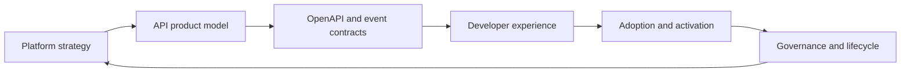

# Technical Product Management Teaching

Public sanitized education repository for API product managers, platform product leaders, solution architects, and technical product managers.

Last updated: 11 August 2026.

This repository turns platform product practice into teachable lessons: API management, system design, IAM, event-driven architecture, OpenAPI, API versioning, governance, developer experience, and platform strategy.

## Latest Teaching Context

New examples should connect API and platform strategy to current product work: BuildAI's evaluation and release gates, Nexra's authenticated developer-console journeys, and Synaptiq's setup-gated engineering control plane. The teaching material should continue to show how to explain technical boundaries without overstating implementation or production readiness.

> Public sanitized showcase version based on real product experience. All examples use mock organizations, fictional APIs, and simplified architecture patterns.

## Who This Is For

- Product managers moving into API, platform, or AI product roles.
- Engineers and solution architects who want stronger product language.
- Developer relations and developer experience teams.
- Founders building API-first or platform-led products.

## Curriculum

| Module | Focus | Outcome |
| --- | --- | --- |
| 01 | API product management | Define APIs as products with users, lifecycle, adoption, and governance. |
| 02 | System design for PMs | Ask better architecture questions and identify trade-offs. |
| 03 | IAM and OAuth | Understand identity, authorization, scopes, tenants, and consent. |
| 04 | Event-driven architecture | Design event contracts, webhooks, queues, and replay patterns. |
| 05 | OpenAPI and docs | Turn API contracts into developer experience assets. |
| 06 | Versioning and deprecation | Manage change without breaking developers. |

## Repository Map

```text
curriculum/
  README.md
lessons/
  01-api-product-management.md
  02-system-design-for-pms.md
  03-iam-and-oauth.md
  04-event-driven-architecture.md
  05-openapi-and-developer-experience.md
  06-versioning-deprecation-governance.md
diagrams/
  api-product-operating-model.mmd
  event-driven-platform.mmd
exercises/
  api-lifecycle-review.md
  openapi-quality-review.md
  deprecation-plan.md
case-studies/
  developer-portal.md
  api-marketplace.md
interview-prep/
  platform-product-interview-guide.md
```

## Core Teaching Model



## Featured Topics

- API product discovery and segmentation.
- Developer portal operating models.
- OAuth, consent, scopes, tenancy, and entitlement design.
- OpenAPI quality reviews and SDK readiness.
- Event-driven platform design.
- Versioning, deprecation, and migration planning.
- Platform metrics, monetization, and governance.

## Interview Prep

The interview resources help candidates explain platform trade-offs clearly:

- How to define an API product strategy.
- How to evaluate a developer portal.
- How to reason about identity and access control.
- How to balance product velocity with platform governance.
- How to describe architecture decisions without overclaiming implementation depth.
