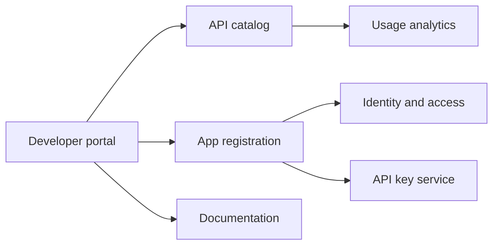

# Case Study - Developer Portal

## Scenario

A platform team needs a developer portal for API discovery, onboarding, documentation, app registration, and usage analytics.

## Product Goals

- Reduce time to first successful API call.
- Make app registration self-service.
- Provide consistent API documentation.
- Give platform teams visibility into adoption.
- Support partner onboarding and governance.

## Architecture

## Product Metrics

- Time to first API call.
- App registration completion rate.
- Documentation search success.
- API error rate by app.
- Active developers by segment.

