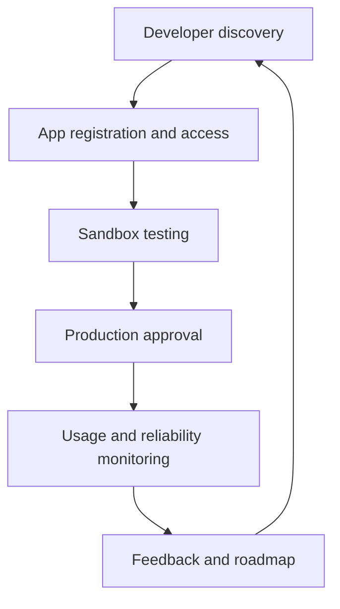

# 01 - API Product Management

## Core Idea

An API is not just an endpoint. It is a product surface with users, onboarding, documentation, uptime expectations, support needs, commercial strategy, and lifecycle governance.

## Product Questions

- Who is the developer, partner, or internal team using this API?
- What job are they trying to complete?
- What does successful integration look like in the first hour, first day, and first month?
- What documentation, SDKs, sandbox data, and support channels are required?
- What governance is needed before the API becomes generally available?

## Operating Model

## Exercise

Choose an API and define:

- Target developer persona.
- Primary use case.
- Activation metric.
- Documentation must-haves.
- Versioning and support policy.

