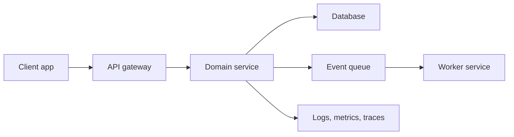

# 02 - System Design For Product Managers

## Core Idea

Product leaders do not need to implement every subsystem personally, but they do need to understand the architecture decisions that affect reliability, cost, user experience, security, and delivery risk.

## Questions To Ask

- What are the critical user journeys?
- What are the peak load assumptions?
- Which dependencies can fail?
- What data is sensitive?
- What must be synchronous and what can be asynchronous?
- What is the rollback path?

## Reference Pattern

## Trade-Off Language

Strong TPMs translate architecture trade-offs into product impact:

- Latency affects conversion and perceived quality.
- Reliability affects trust and support load.
- Governance affects delivery speed and platform safety.
- Observability affects time to resolution.

