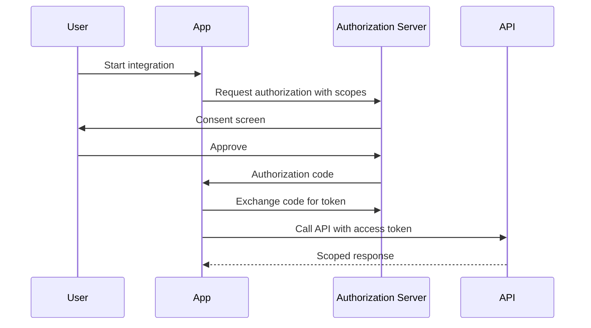

# 03 - IAM And OAuth

## Core Idea

Identity and access management determines who can do what, on whose behalf, against which resource, under which conditions.

## Building Blocks

- User identity.
- Organization or tenant identity.
- Application identity.
- API keys for app-level access.
- OAuth for delegated access.
- Scopes for permission boundaries.
- Audit logs for accountability.

## OAuth Flow

## Product Decisions

- Which permissions need explicit consent?
- Which roles can create apps or keys?
- How are tokens revoked?
- What is visible in the audit trail?

