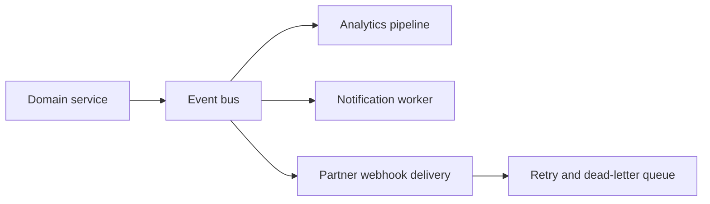

# 04 - Event-Driven Architecture

## Core Idea

Events let platforms react to meaningful business changes without coupling every system directly to every other system.

## Common Patterns

- Webhooks for external developer notifications.
- Queues for asynchronous work.
- Event buses for domain-level integration.
- Dead-letter queues for failed processing.
- Replay mechanisms for recovery.

## Product Questions

- Which events should external developers receive?
- What delivery guarantees are promised?
- How can developers test webhook handlers?
- What happens when a subscriber is unavailable?

