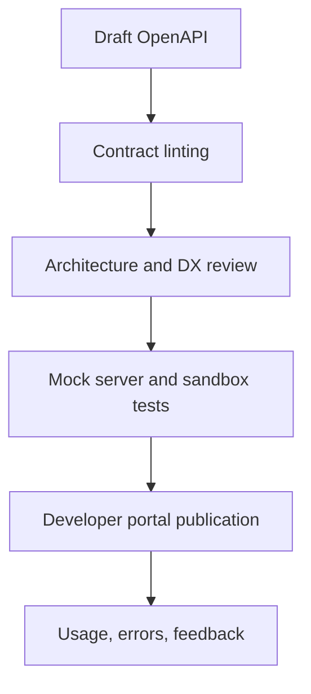

# 05 - OpenAPI And Developer Experience

## Core Idea

OpenAPI is more than documentation. It is a contract that can drive review, SDK generation, sandbox testing, changelogs, governance, and developer onboarding.

## Quality Checklist

- Clear summaries and descriptions.
- Consistent authentication scheme.
- Realistic examples using mock data.
- Error response schemas.
- Pagination standards.
- Version and deprecation metadata.
- Tags aligned to developer tasks.

## Review Workflow

