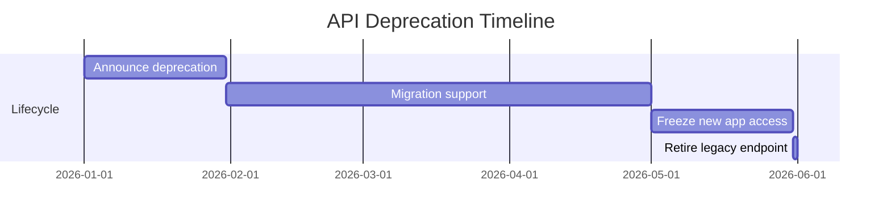

# 06 - Versioning, Deprecation, And Governance

## Core Idea

API change is a product problem. Versioning and deprecation policies protect developer trust while giving the platform room to evolve.

## Governance Rules

- Breaking changes require a new major version or explicit migration path.
- Deprecation notices should include dates, impact, replacement APIs, and support contact.
- High-usage APIs require migration analytics before retirement.
- Docs, SDKs, examples, and changelogs must be updated together.

## Deprecation Timeline

